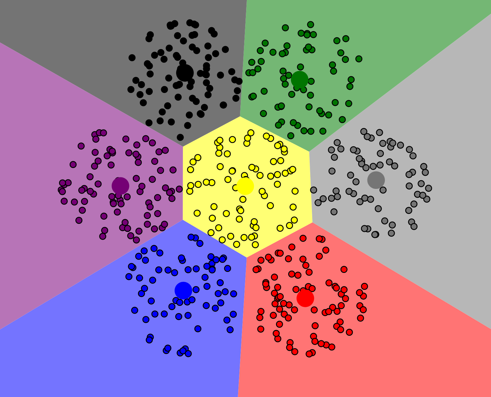
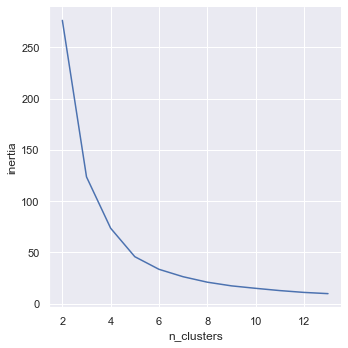

% Unsupervised Learning and Clustering
% CIS 241, Dr. Ladd
% 🪁🪁🪁

# What is Unsupervised Learning?

## So far we have learned *supervised learning* techniques.

Predicting a known target from a set of predictor variables.

e.g. Logistic Regression, Naive Bayes, KNN, Random Forest, etc.

## Unsupervised learning has *no target variables*.

It constructs a model of the data without learning from existing labels.

## Unsupervised learning can have different uses.

- Dimension reduction: get a more manageable set of variables.
- Clustering: identify meaningful categories in the data.
- Exploration: analyze variables and discover relationships.

## Types of unsupervised learning

- Principal component analysis (PCA): dimension reduction
- Correspondence analysis: dimension reduction
- **K-Means Clustering: clustering and exploration**
- Hierarchical Clustering: clustering and exploration

# K-Means Clustering

## Like KNN, this method is based on *distance*.

## K-Means attempts to minimize the distance of each point to the *centroid* (mean) of its assigned cluster.

---

{width=70%}

[Visualizing K-Means Clustering](https://www.naftaliharris.com/blog/visualizing-k-means-clustering/)

## K-Means is typically used to locate "natural" clusters in the data.

It can't find clusters that aren't there!

## K refers to the number of clusters/centroids that the method will find.

Just like in KNN, you have to choose K *based on the data*! (More on this later.)

# K-Means Clustering in Python

## Just like KNN, you must scale your data!

For a dataset of all quantitative variables, use `StandardScaler()` as usual.

It is best to stick with numerical variables for clustering, but if you must use categorical variables, remember to use one-hot encoding before scaling. A `MinMaxScaler()` may also be useful in this case.

## You don't need to split your data.

Because this is an unsupervised method, there's no need to reserve a test set. There would be nothing to test on!

## Code for running K-Means.

This isn't the whole workflow, it's just the model code.

```python
from sklearn.cluster import KMeans

kmeans = KMeans(n_clusters=3, n_init=10, max_iter=300, random_state=0)
kmeans.fit(X_std)
```

## As always pay attention to the hyperparameters.

- `n_clusters`: the number of clusters the model will produce. This is "K"!
- `n_init`: the total number of times the model will be run.
- `max_iter`: the number of iterations the model will take to find centroids.
- `random_state`: keeps the model the same every time.

## We can interpret the clusters in two ways.

First, we can look at the relative size of the clusters. Are they relatively balanced? Unbalanced clusters may mean we need to try again.

```python
# Using the .labels_ attribute of our model
pd.Series(kmeans.labels_).value_counts()
```

## We can interpret the clusters in two ways. (cont.)

Next, we can look at the cluster means for each cluster. This tells us where the centroid is and gives us a sense of how the different variables interact.

```python
# Using the .cluster_centers_ attribute of our model
# Get the centers into a dataframe:
centers = pd.DataFrame(kmeans.cluster_centers_, columns=predictors)

# Tidy our dataset with .melt() (the opposite of pivot):
centers = centers.melt(ignore_index=False).reset_index()

# Create bar plots to compare the centers
sns.catplot(x='variable',y='value',col='index',kind='bar',data=centers)
```

## Try K-Means Clustering for the `penguins` dataset.

1. Select features and prepare data. Consider standardizations as well as null values.
2. Run K-Means clustering. Be thoughtful about the hyperparameters, especially K (`n_clusters`)!
3. Assess your model using the cluster sizes and a bar plot of the cluster means.

Good luck! 🐧🐧🐧

# What! About! K!

## The best way to choose K is based on your knowledge of the data.

You can review the documentation and use every exploratory tool in the book to get a sense of how many clusters there might be in the data.

## You might also have a procedural reason for choosing a number.

Maybe your company needs to split customers into exactly 4 categories, for instance.

## If you're lost when choosing K, you can try the "elbow method."

1. Run K-Means multiple times, with a different value for K each time.
2. Look at how close the values are to their centroid. (This is called inertia.)
3. Create a graph to see at what value for K this inertia measure begins to settle.

## Here's what the elbow method looks like in Python.

```python
# Steps 1 & 2: Run K-means with different K and get inertia
inertia = []
for n_clusters in range(2,14):
    kmeans = KMeans(n_clusters=n_clusters, random_state=0).fit(X_std)
    inertia.append(kmeans.inertia_ / n_clusters)

# Step 3: Put into a dataframe and create a line plot
inertia = pd.DataFrame({'n_clusters': range(2,14), 'inertia': inertia})
sns.relplot(x='n_clusters',y='inertia',kind='line',data=inertia)
```

## An example of the elbow method plot for the penguins dataset.



See how the "elbow" bends around 3 or 4 clusters? 💪
