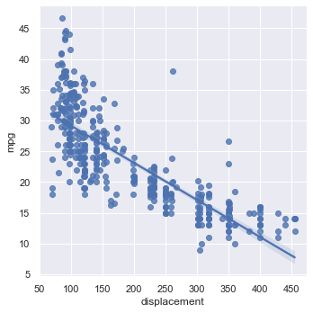

% Correlation
% CIS 241: Data Mining
% Dr. Ladd

# Are Two Variables Related?

Not *how* they are related.

## Our first form of bivariate analysis.

Correlation always involves two or more variables (columns).

## Correlation coefficient measures the extent to which two variables are related, from -1 to 1.

Pearson’s correlation coefficient multiplies the deviations from the mean for two variables, and divides by the product of the standard deviation.

Tells us the *strength* of a correlation.

## Pearson's correlation, *r*, is the default in Pandas.

```python
# Load mpg sample dataset
cars = sns.load_dataset('mpg')

# Calculate correlations between all columns in a dataframe 
cars.corr()

# Calculate correlation between just two variables
cars.mpg.corr(cars.displacement)
```

# Visualizing Correlation

## Scatterplots show potential correlation between two variables

The y-axis shows the *dependent* variable, while the x-axis shows the *independent* variable.

---


```python
sns.relplot(x='displacement',y='mpg',data=cars)
```

## Regression plots add a line of best fit



```python
sns.lmplot(x='displacement',y='mpg',data=cars)
```

## Joint plots also show distributions

```python
sns.jointplot(x='displacement',y='mpg',data=cars,kind="reg")
```

## Avoid overplotting with heatmaps or kernel density estimation.

:::::::::::::: {.columns}
::: {.column width="50%"}

:::
::: {.column width="50%"}

:::
::::::::::::::

## Make these with `displot` (not `relplot`).

```python
# Heatmap by default
sns.displot(x='displacement',y='mpg',data=cars)

# Special `kind` parameter for kernel density estimation
sns.displot(x='displacement',y='mpg',data=cars, kind='kde')
```

## Correlation matrix shows all possible correlations.

```python
(sns.heatmap(cars.corr(), 
             vmin=-1, 
             vmax=1, 
             cmap=sns.diverging_palette(20, 220, as_cmap=True)))
```


# Hypothesis Tests for Correlation

## How do we know if a correlation coefficient is statistically significant?

There are standard parametric approaches to this, but we can use permutation!

## Instead of resampling, we can *rearrange* the variables at random.

```python
def corr_permutation(df,var1,var2):
    shuffled = df[var1].sample(frac=1).reset_index(drop=True)
    corr = shuffled.corr(df[var2])
    return corr
```

## Let's Try It!

Using the function from the previous slide, run 5000 permutations of the correlation between engine displacement and miles per gallon.

Graph the results as a histogram and calculate a p-value. Is this a statistically significant correlation?

# Don't be fooled!

---

Always use summary statistics and visualization *together*.


## If we have the same **mean**, **standard deviation**, and **correlation** we might expect the data sets to be similar...

---

But they could be very clearly and visually **distinct**!


## Data Challenge

Use `pandas` to find the summary statistics for each dataset in the <a href="/CIS241/data/DatasaurusDozen.tsv" download>`datasaurus_dozen`</a>.

- Find mean, standard deviation, and correlation for both x and y of each dataset. (You may need to group things by the "dataset" column.)
- When you're done, try making scatter plots! (You may need to use the `col` parameter.)
