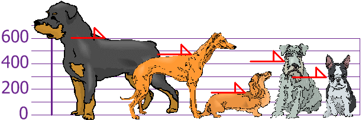
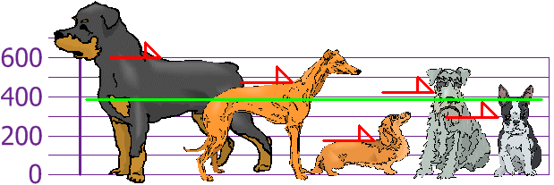
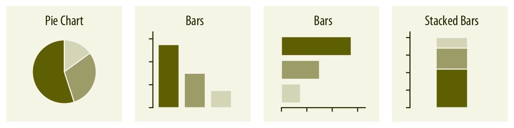

% Exploratory Data Analysis
% CIS 241, Dr. Ladd

# *Look* at the Data

## John Tukey (1962)


# Summary Statistics

## Summary Statistics are focused on the **location**, **variability**, and **distribution** of data.

# Location: What is the data's "typical value"?

## Let's imagine a variable showing the heights of different dogs.



## Mean is the sum of all values divided by the number of values.

AKA "average"



$\dfrac{600+470+170+430+300}{5} = 394$

## We can calculate the mean easily in Python.

```python
# Put the dog heights into a dataframe
dogs = pd.DataFrame({"height": [600, 470, 170, 430, 300]})

dogs.height.mean() # Calculate the mean
```

## Median is the value such that half of the data lies above and below.

AKA "50th percentile"


```python
dogs.height.median()
```

## Percentile is a value such that *P* percent of the data lies below.

AKA "quantile"

## The 25th Percentile is the 1st Quartile.


```python
dogs.describe()
```

## The 75th Percentile is the 3rd Quartile.


```python
dogs.describe()
```

## The median is the 2nd Quartile!!

## An **outlier** is a data value that's different from most of the data.

AKA "extreme value"

## A **robust** variable is not sensitive to extreme values.

# Variability: Is the data tightly clustered or spread out?

## The **interquartile range** is the difference between the 1st and 3rd quartiles.

```python
dogs.height.quantile(.75)-dogs.height.quantile(.25)
```

## A **deviation** is the difference between an actual value and an estimate of location (like the mean).


## The **variance** is the sum of the squared deviations, divided by the number of values.


$\dfrac{206^2+76^2+(-224)^2+36^2+(-94)^2}{5} = 21,704$

## The **standard deviation** is the square root of the variance.


Rottweilers *are* tall, and dachsunds *are* short---compared to the standard deviation from the mean.

## Now calculate the variance and standard deviations in Python.

```python
dogs.height.var()

dogs.height.std()
```

Were these the results you expected?

## Population vs. Sample

When you have "N" data values:

- The Entire Population: divide by N when calculating variance (like we did)
- A Sample: divide by N-1 when calculating variance

Sample variance: $\dfrac{108,520}{4}=27,130$  
Sample standard deviation: $\sqrt{27,130}=164$

Think of it as a "correction" when your data is only a sample. Pandas does this by default!

## Neither the mean, variance, nor standard deviation are **robust**. They are all very sensitive to outliers!

# Distributions: How many of each value are there?

## Histograms show distributions based on frequency counts.


## The normal distribution has most values in the middle.


Be careful: normal distributions are assumed for many statistical analyses!

## Boxplots show distribution based on the median.


# Correlation: Are two variables related?

## Location, Variability, and Distribution are for one variable at a time (univariate analysis). Correlation is for *two* variables (bivariate analysis).

## Scatter plots and correlation coefficients are used to determine correlation.

We'll talk more about correlation in a couple weeks!

# Visualization


## Some Good Resources on Visualization

- Claus Wilke's [Fundamentals of Data Visualzation](https://clauswilke.com/dataviz/) (The illustrations in this slide show come from here!)
- [The Seaborn tutorials](https://seaborn.pydata.org/tutorial.html)

# Why Do We Visualize Data?

## Visualization can be *exploratory*, *explanatory*, or both!

- Exploratory viz helps *us* (the researchers or analysts) understand the data.
- Explanatory viz helps *others* (the clients or audience) understand our analysis.
- Many visualizations do both of these things at once!

# What Does Visualization Help Us to See?

## Viz Can Help Us See *Amounts*.


- Variable types: 1 categorical and 1 numerical
- Common graph types: Bar plot (Don't confuse the dot plot with the scatter plot!)

## Plot *Amounts* With Multiple Categories.


- Variable types: 2 or more categorical, 1 numerical
- Common graph types: Grouped or stacked bar, heat map

## Viz Can Help Us See *Distributions*.


- Variable type: 1 continuous (numerical)
- Common graph types: Histograms, Density plots, Q-Q plots

## *Distributions* with Multiple Categories.


- Variable types: 1 continuous (numerical), 1 categorical
- Common graph types: Box plots, Violin plots

## You Try It!

Look at the `taxis` data set. What visualization type would you use to compare the counts of each destination Borough? Which variables would you use, and what *kind* of variables are they? Jot down your answers.

## Viz Can Help Us See *Proportions*.



- Variable types: 1 numerical, 1 categorical
- Common graph types: Pie chart, Bar plot

## Viz Can Help Us See *Relationships*.


- Variable types: 2 continuous (numerical), (3 in a bubble chart)
- Common graph types: Scatter plot, Bubble Chart, Hex bins, Density contours

## You Try It!

Look at the `taxis` data again. What visualization type would you use to compare the distribution of tips among different taxi colors? Which variables would you use, and what *kind* of variables are they? Jot down your answers.

## Viz Helps Us See *Time*, *Location*, *Uncertainty*...


More on these viz types in future lessons!

# Make Great Viz with `seaborn`

## Import Seaborn and add default theme

```python
import seaborn as sns
```

```python
sns.set_theme()
# It's a good idea to use this every time
```

## Each Seaborn function looks for a data parameter and variables

```python
# A scatter plot as an example
sns.relplot(x="FirstVariable",y="SecondVariable",data=YourDataFrame)
```

In this example, `FirstVariable` becomes the x-axis and `SecondVariable` becomes the y-axis. You can also add a mapping for `hue` (i.e. color).

## Create different shapes and plot types with different functions.

- `sns.relplot()`: scatter plots and line plots (relationships)
- `sns.displot()`: histograms and frequency polygons (distributions)
- `sns.catplot()`: bar plots and boxplots (categories)
- and more we'll cover later!

Sometimes you'll use the `kind` parameter to set the type of plot!

## You Try It!

Create a plot to compare the distance a taxi traveled to the total fare using the `taxis` DataFrame. Then create the same plot but show color as the type of payment.

## Use the `col` parameter to create side-by-side plots for different categories.

```python
sns.displot(x="NumericalVariable", col="CategoricalVariable", data=YourDataFrame)
```

## Use `.set_axis_labels()` to add your own graph labels.

Never rely on the default column names! You can "chain" this function onto an existing Seaborn plot.

```python
sns.catplot(...).set_axis_labels("A Better Label for X", "A Better Label for Y")
```

## You Try It!

Create a plot showing the distribution of tips in the `taxis` dataset. Then show the distributions according to each pickup borough, in different columns. Finally, change the size of the bins in each distribution to show less detail (wider bars).

# Ugly, Bad, or Wrong 

---


---


---


---


---


---


## More Examples of Bad Viz

[viz.wtf](https://viz.wtf/)

[r/dataisugly](https://www.reddit.com/r/dataisugly/)
