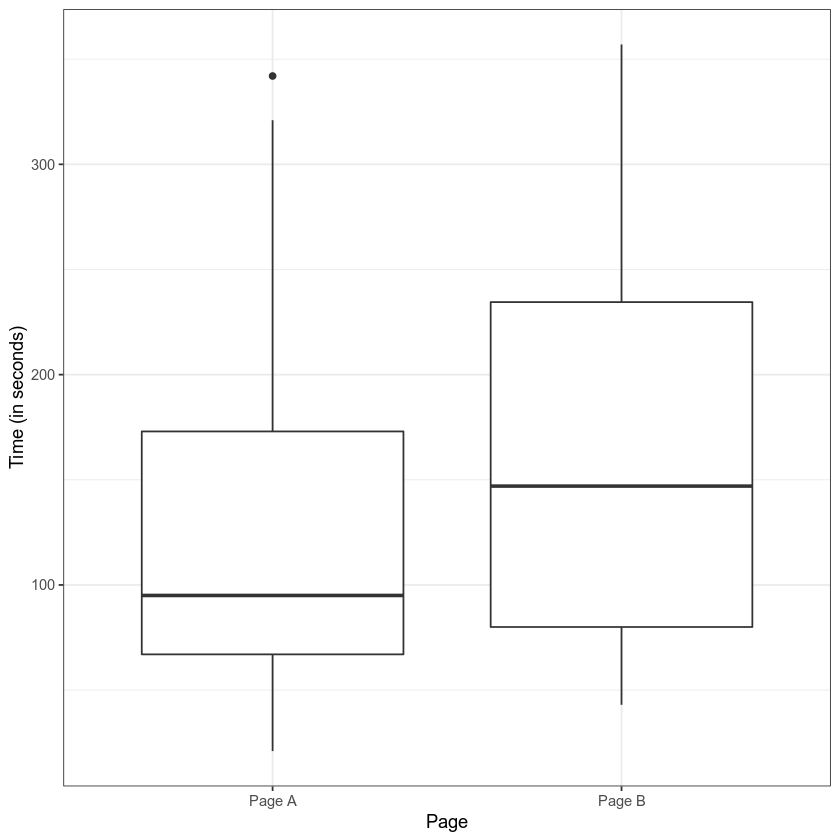
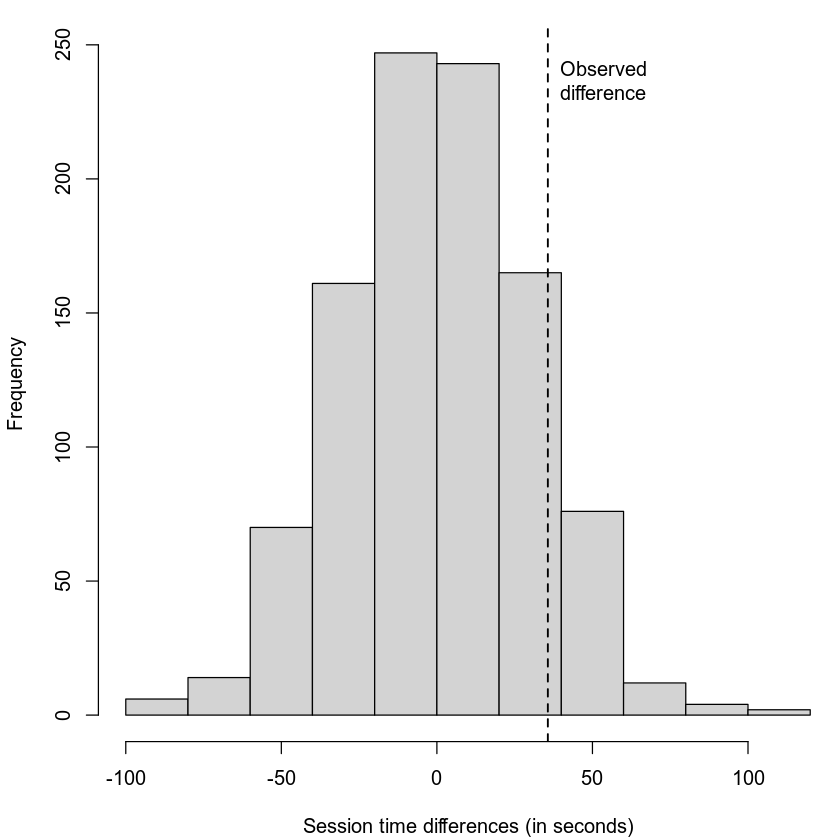

% Hypothesis Testing
% CIS 241: Data Mining
% Dr. Ladd

# Why Do We Need a Hypothesis?

## Humans underestimate randomness.


## Hypothesis tests protect researchers from being fooled by random chance.

# Sample & Population

## A **sample** is the data we actually have, some subset of all possible data.

## The **population** is the full data, the entire thing. (It's usually impossible to collect it all.)

## Hypothesis tests help us to know if the observed differences in the sample are the result of random chance.

# The Null and Alternative Hypotheses

## The **Null Hypothesis** is a baseline assumption that the result is due to chance.

## The Null Hypothesis assumes *equality*.

Consider two sample groups, A and B. (Such as the male and female groups of your alcohol use data.)

In a t-test, the null hypothesis would assume that the means of A and B are *equal*, that there is no difference between them, and that any observed difference we see is the result of randomness.

## In a hypothesis test, we try to prove the null hypothesis *wrong*.

We attempt to disprove the null hypothesis by showing that the observed data **isn't** the result of randomness.

## The **Alternative Hypothesis** accounts for all possibilities that *aren't* the Null Hypothesis.

If there's a null hypothesis, there has to be an alternative hypothesis.

If the null hypothesis is that A and B are equal, then the alternative hypothesis would be that A and B are *not* equal (either smaller or bigger).

## The Alternative Hypothesis can be One- or Two-Tailed.

- One-tailed: We only care about a non-equal result in one direction, i.e. if A > B but **not** if A < B.

- Two-tailed: We care about differences in both directions, i.e. A != B but could be larger or smaller.

Different research questions lead to different alternative hypotheses.

# Let's consider some examples

## What are the Null and Alternative Hypotheses?

1. Is the median house price in Pittsburgh larger than the median price in Washington?

2. Is the mean number of mountain lions per 100 km^2 equal in North and South America?

3. NHANES reports the average starting age of smoking is 19. Is this correct, or is the true mean lower than this?

# Interpreting a Hypothesis Test

## Let's walk through an example

Say you have two web pages, Page A and Page B, and you've measured the amount of time internet users spend on each page. You're trying to decide whether to replace Page A with Page B.

## First look at the difference:



## Setting up the test

The Null Hypothesis is that: 

`mean(A) = mean(B)`

The Alternative Hypothesis is that:

`mean(B) > mean(A)` (one-tailed)

## Let's imagine reshuffling the data.

We have two clear groups: the people who saw Page A and the ones who saw Page B. But we could reshuffle this data a thousand times in a thousand different configurations, where the session times are separated into equally sized but random groups.

In the end we'd have a *distribution* of how much the means differ among a thousand random groups.

## We can compare our **observed difference** to that distribution.



---

In this case, we care about how often the random differences were greater than the observed difference.

I.e., how often the values were to the right of the dotted line.

In this case, that was about 12% percent of the time. That's a lot! And that means that this observed difference isn't all that unusual.

# Statistical Significance and the P-value

## We could keep looking at graphs like these, but that's imprecise.

Instead, we can measure the probability of obtaining results as unusual as the observed result.

This probability is called the p-value!

## The p-value's formal definition:

Given a chance model that embodies the null hypothesis, the p-value is the probability of obtaining results as unusual or extreme as the observed result.

In our example, our 12% was a p-value of .12!

## .05 is a common *alpha*, or pre-determined cutoff for significance.

If the p-value is lower than .05 (5%), we can reject the null hypothesis.

If the p-value is higher than .05 (5%), we fail to reject the null hypothesis and our result could be random.

This is just a rule of thumb!

---


---

## T-Tests let you calculate a p-value for a difference in means.

In our example of two groups in our data, we could test whether their difference in means is significant using a **t-test**. It calculates a p-value based on a "t-distribution."

Different statistical tests calculate p-values for other kinds of differences.

## All other things being equal...

- The observed difference increasing will decrease the p-value (more likely to find significance)
- The sample size increasing will decrease the p-value (more likely to find significance)
- The variability increasing will increase the p-value (less likely to find significance)

## Don't *only* consider the p-value!

Consider results that are:

- **Statistically significant and practically significant (i.e. useful)**
- Statistically significant and *not* practically significant (i.e. not useful)
- Statistically insignificant and practically significant 
- Marginally significant and practically significant

## Error in Hypothesis Testing


- Type I Error (alpha-error) is rejecting the null hypothesis when it is true.

- Type II Error (beta-error) is failing to reject the null hypothesis when it is false.

Misreading or overemphasizing the p-value can lead us to error!

# How do you solve a problem like a T-Test?

## T-Tests rely on *assumptions*.

- Normality (Are both samples normally distributed?)
- Equality of Variance (Are the variables spread out roughly the same amount?)

## If either of these assumptions aren't met, our t-test could be misleading!

## "Parametric" hypothesis tests were designed to solve a problem before computers existed, but now there are other approaches.

# Resampling

## Resampling is simply drawing multiple random samples from observed data.

I can grab a sample of 5 observations. Then I can "resample" 5 more. Then 5 more, and so on and so on.

## First proposed in the 1960s, resampling procedures weren't practical until computing took off in the 1980s.

## Resampling is an umbrella term. It can include:

- The Bootstrap, used to assess the reliability of an estimated statistic
- Permutation Tests, used as an alternative to parametric hypothesis tests

## You can resample with or without *replacement*.

Replacement means an item is returned to the sample before the next draw (i.e. you could wind up with the same observation multiple times).

# Permutation Tests

## A permutation test solves the t-test problem!

It doesn't matter whether the samples are normally distributed or whether their variance is equal. There are no assumptions in a permutation test.

## *Permute* means to change the order of a set of values.

In a permutation test, you rearrange groups randomly to determine a permutation distribution.

## A permutation distribution embodies the *null hypothesis*.

It shows you what the distribution would look like if the difference between the groups was the result of random variation.

## You can create a permutation procedure to replace different kinds of statistical tests.

Let's look at the steps of a permutation test that would replace a two-sample t-test...

---

1. Randomly resample (without replacement) a group the same size at the first group.
2. From the remaining data, randomly resample (without replacement) a group the same size as the second group.
3. Calculate the difference in means between the two resamples. This is one permutation.
4. Repeat these steps as many times as you want to create a permutation distribution.
5. Compare the observed difference in the real groups to the permutation distribution.

## You can use the permutation distribution to calculate a p-value.

# Permutation Tests in Python

## Let's look at the `penguins` dataset.

```python
import pandas as pd
import numpy as np
import seaborn as sns
sns.set_theme()

penguins = sns.load_dataset('penguins')
penguins
```

```python
sns.catplot(x="species",y="bill_depth_mm",kind="box",data=penguins)
```

## What's the difference in means?

```python
mean_diff = (penguins[penguins.species == "Chinstrap"].bill_depth_mm.mean() 
             - penguins[penguins.species == "Adelie"].bill_depth_mm.mean())
mean_diff
```

## Functions create reusable code

```python
def adding_func(x,n):
    sum = x + n
    return sum
```

```python
adding_func(4,2)
```

First name the function and define input. Then do something and return a result!

## Repeat functions with list comprehensions

These work just like loops!

```python
repeated_adding = [adding_func(4,2) for i in range(100)]
```

## Create a random `sample`

```python
your_sample = your_dataframe.sample(n=number_of_rows)
```

## Let's create a function for permutation!

```python
# This function assumes that everything not in the first
# category will be in the other.

def mean_perm(df, var, cat, group1):
    group1_len = len(df[df[cat] == group1])
    group1_sample = df.sample(n=group1_len)
    group2_index = set(df.index) - set(group1_sample.index)
    group2_sample = df.loc[list(group2_index)]
    return group1_sample[var].mean() - group2_sample[var].mean()
```

You can reuse this code!

## Now we can make 5000 permutations.

```python
# First we need *only* Chinstrap and Adelie
# You can do this on one line.
chinstrap_adelie = (penguins[(penguins.species == "Chinstrap") | 
                             (penguins.species == "Adelie")].dropna())

# Then we can permute
mean_perms = (pd.Series([mean_perm(chinstrap_adelie, 
                                   "bill_depth_mm", 
                                   "species", 
                                   "Chinstrap") for i in range(10000)]))
```

## Let's look at the results in a histogram

```python
plt = sns.histplot(x=mean_perms)
plt.axvline(x=mean_diff, color="red", ls="--")
```

How is this different from previous Seaborn plots?

## Finally, we can calculate a p-value:

```python
p_value = np.mean(mean_perms > mean_diff)
p_value
```

Why does this code work?

Is our result statistically significant? Is it practically significant?

# You Try It!

## Permutation Exercise

Determine if users spend significantly more time on Page B than they do on Page A.

1. Download <a href="https://jrladd.com/CIS241/data/web_page_data.csv" download>web_page_data.csv</a>.
2. Make a boxplot of session times for Pages A and B.
3. Calculate the observed difference in means.
4. Run 2000 permutations of randomly resampled groups.
5. Make a histogram of permutation results and show the observed difference as a vertical line.
6. Calculate the p-value for your permutation test.
