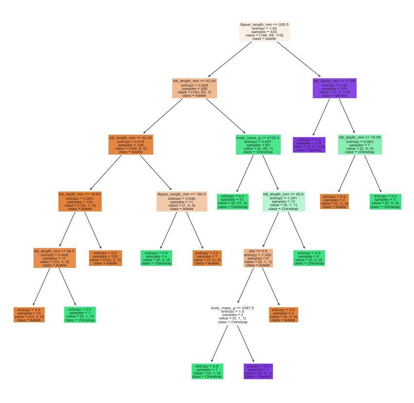

% Decision Trees and the Random Forest
% CIS 241, Dr. Ladd
% 🌳🌲🌳🌲

# What are Decision Trees?

## A tree model is a set of rules to split data into different categories.

## Decision trees are trained using *recursive partitioning*.

---

{width=70%}

## Decision Trees create nodes (branching rules) based on optimal split values.

## Tree models can be used as both classifiers and regressors.

But we will focus on their more common use as classifiers!

## Trees can find hidden patterns and help you interpret interactions between variables.

But they are not so reliable one-at-a-time!

# What is the Random Forest?

## To get more accurate predictions, it's best to use many trees together.

And what do you call a lot of trees? A forest!

## The random forest is an *ensemble* method.

You can see all the metaphors here: a forest, a musical ensemble, etc.

The decision trees are put together using "bagging": bootstrap aggregating.

## The random forest method can help you determine which predictors are most important.

This is referred to as "variable importance" and takes advantage of decision trees' skill at finding patterns in the data.

## Pay attention to your model's *hyperparameters*.

- `min_samples_leaf`: the minimum number of records in a terminal node (leaf)
- `max_leaf_nodes`: the maximum number of nodes in the entire tree

Setting these can help you create smaller trees and avoid spurious results! 

# Decision Trees in Python

## ???

By now, you're equipped to find out how to do this on your own, so let's try an example.

## Create a Random Forest Classifier for the `penguins` dataset.

1. Select features and prepare data: you will predict the `species` of the penguins.
2. Fit a random forest classification model. Be thoughtful about the hyperparameters!
3. Find the variable importances from your model.
4. Do some out-of-sample validation of your model, using the usual metrics.

Good luck! 🌲🌳🌲🌳
