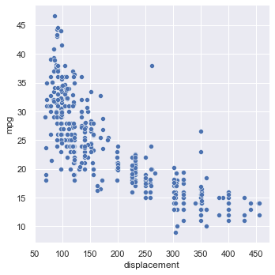
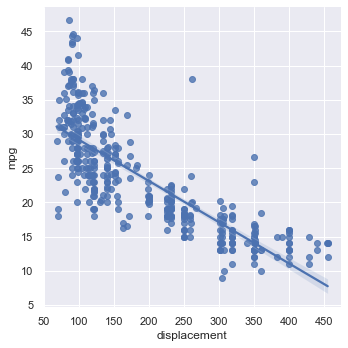

% Linear Regression
% CIS 241
% Dr. Ladd

# Linear Regression

## We can use correlation coefficients and correlation tests to learn the *strength* of a relationship, but how do we learn the *nature* of a relationship?

## Questions we might want to answer with regression:

- Does x influence y?
- Is crop growth rate improved by fertilizer?
- Do taller sprinters run faster?

## Linear prediction models, also called regression models, help us to answer these kind of questions, which explore *relationships*.

## A **prediction model** analyzes data that the researcher (*you!*) supplies, and calculates numerical coefficients to help with prediction.

## Linear regression is just one type of model!

# How does linear regression work?

## For many kinds of data, it is possible to "fit" a line to a set of data points. 

## That line represents the connection between an ________ (x-axis) and a ________ (y-axis) variable.

## And in this case, the ______________ variable is a function of the ________________ variable. 

## To define independent and dependent variables, you need to *use your human brain*.

Come up with a *rationale* for why you think they would be related.

## This does *not* mean that x causes y! A regression can't show that.

It's *not* a good idea to just try to regress any set of variables together.

**Correlation does not mean causation!!**

## Regression can be for *explanation* or *prediction*.

# Calculating simple linear regression

## $Y=mX+b$

Can also be written as: $Y=b_{1}X+b_{0}$

## $Y=b_{1}X+b_{0}$

$Y$ is your dependent variable.

$X$ is your independent variable.

## $Y=b_{1}X+b_{0}$

Two coefficients:

$b_{1}$ (or $m$) describes the *slope* of the line (and its direction).

$b_{0}$ (or $b$) describes the height of the line when $X$ is 0. This is called the y-intercept or simply the intercept.

## We can provide 2 numeric variables ($X$ and $Y$), and Python will calculate the $b_{0}$ and $b_{1}$ values.

This is what it means to "fit" a linear model.

## In theory, if you know any $b_{0}$ and $b_{1}$, you can use any new X value to *predict* a Y value. Wow!

# Linear regression in Python

## Always start with exploratory analysis.

Do you have good reason to believe that a linear regression or predictive model would help? Is there a relationship between variables that's worth learning about?

```python
# Let's make a scatter plot of engine displacement and
# fuel efficiency, in the mpg dataset.

sns.relplot(x="displacement",y="mpg",data=cars)
```

---



## It looks like there might be a linear relationship!

We can see a general trend: as engine size goes up, fuel efficiency goes down. Now we're ready to try modeling this relationship.

## Beware!


## For statistical modeling in Python, we can use `sklearn`.

```python
# You only need to import the functions you will use
# This may be different every time
from sklearn.linear_model import LinearRegression
from sklearn.model_selection import train_test_split
from sklearn.metrics import mean_squared_error, r2_score
```

## The scikit-learn modeling workflow

1. Choose your model
2. Split the data into train and test portions
3. Fit the model to your training data
4. Summarize or predict based on the model
5. Validate and assess the model

Full scikit-learn documentation [here](https://scikit-learn.org/stable/index.html)

## Why do we split the data?

A training set will determine the model's coefficients, and a test set will let us see how well it works on *new* data that it *hasn't already seen*.

## First we select our model: linear regression

That's why we imported the LinearRegression class above.

## Then we split the data.

```python
# The train_test_split() function will create 4 variables
X_train, X_test, y_train, y_test = train_test_split(
    cars[["displacement"]], # The first argument is the X variable
    cars[["mpg"]], # The second argument is the Y variable
    test_size=0.4, # Proportion of the data in the test set
    random_state=0) # Set a random state so it's the same every time
```

## Then we can fit our model.

```python
our_model = LinearRegression() # Make an instance of this class
our_model.fit(X_train, y_train) # Run the fit() method on training data
```

## Now we can look at the model's coefficients

```python
# We use f-strings to print complex things, with rounding
print(f"Intercept: {our_model.intercept_[0]:.3f}")
print(f"Coefficient (Slope): {our_model.coef_[0][0]:.4f}")
```

---

With a slope of `-0.0597`, this linear regression provides evidence that as engine displacment increases, fuel efficiency decreases slightly!

For every additional unit of engine displacement, the expected fuel efficiency decreases by 0.0597.

The intercept indicates that if engine displacment were 0, fuel efficiency would be 34.839 miles per gallon.

*Be careful not to imply that there is a direct causal link, especially without more evidence or studies.*

## Compare this to the regression plot.

```python
sns.lmplot(x="displacement",y="mpg",data=cars)
```



## Let's look at that all together.

```python
# Split the data
X_train, X_test, y_train, y_test = train_test_split(
    cars[["displacement"]], 
    cars[["mpg"]], 
    test_size=0.4, 
    random_state=0)

# Fit the model
our_model = LinearRegression()
our_model.fit(X_train, y_train)

# View coefficients
print(f"Intercept: {our_model.intercept_[0]:.3f}")
print(f"Coefficient (Slope): {our_model.coef_[0][0]:.4f}")
```

# Assessing Your Model

## Did our model do a good job?

## Let's *predict* based on our model.

The `predict()` method uses coefficients to calculate new values.

```python
# Today let's focus on in-sample prediction for validation
fitted = our_model.predict(X_train)
fitted
```

We can predict with our training data (in-sample prediction) or with our test data (out-of-sample prediction).

## We can look at the *fitted values* compared to the *residuals*.

Residuals are the differences between the actual observed values and the ones the model predicted.

```python
# Our in-sample residuals:
residuals = y_train - fitted
residuals
```

<small>Think of these as the "errors" that the modeling method produced. If the residuals are symmetrically distributed with the median close to zero, the model may fit the data well.</small>

## Root Mean Squared Error measures how much the residuals stray from the fitted values.

```python
# The raw value, in-sample
np.sqrt(mean_squared_error(y_train, fitted))

# Or neatly printed
print(f"Root mean squared error: {np.sqrt(mean_squared_error(y_train, fitted)):.2f}")
```

This is a good metric for comparing models.

## $R^{2}$ shows the amount (proportion) of variation in $Y$ that is accounted for by $X$.

```python
print(f"Coefficient of determination: {r2_score(y_train, fitted):.2f}")
```

This is also called the "coefficient of determination."

<small>$R^{2}$ ranges from 0 to 1. If it were 1, the variables would make a straight line. If it were 0, the x variable wouldn't predict the y variable at all.</small>

---

In this example, $R^{2}=0.64$, so engine displacement accounts for about 64% of the variation in fuel efficiency.

There's no rule for what makes an $R^{2}$ "good." Consider the context and purpose of your analysis!

In an analysis of ecology or human behavior (very unpredictable) an $R^{2}$ of 0.20 or 0.30, might be considered good. In an analysis predicting mechanical repairs, or recovery from medical procedures, an $R^{2}$ of 0.60 or 0.70 might be considered very poor. 

# You Try It!

## Challenge

With a partner, perform a linear regression to determine how the number of years a worker is *exposed* to cotton dust is related to a measure of lung capacity: the peak expiratory flow rate.

You can [download the data here](https://raw.githubusercontent.com/gedeck/practical-statistics-for-data-scientists/master/data/LungDisease.csv).

## Follow these steps:

1. Determine which should be your dependent and which should be your independent variable.
2. Create a scatter plot with a trend line to see if you think there is a linear relationship. Form a hypothesis with your partner!
3. Using `sklearn`, create a linear regression model, split the data, and fit the model.
4. Interpret the coefficents of the model *completely and accurately and in terms of the data*.
5. Assess your model with $R^2$ and `RMSE`. How did your model do?
